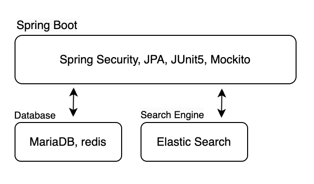
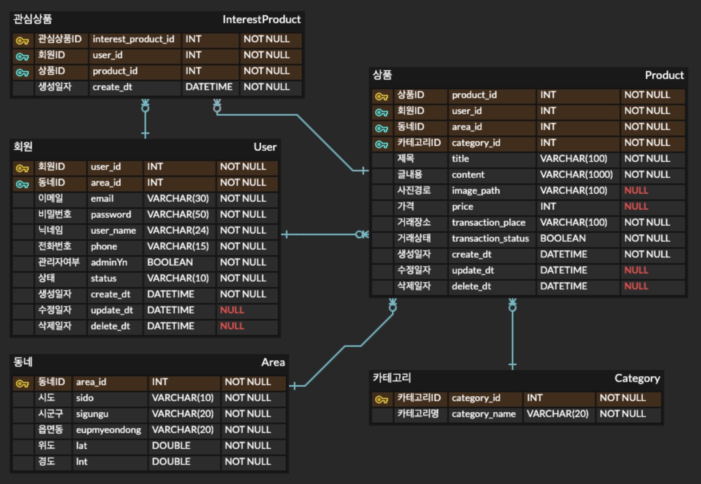

## 프로젝트 주제
- 중고 물품 거래 서비스

## 프로젝트 기획 배경(목적)
- 중고 거래 서비스 (ex 당근마켓) 를 구현해봄으로써 백엔드 구현에 필요한 기술들(스프링 프레임워크, 데이터베이스, 테스트, 형상관리) 에 익숙해지고 새로운 기술 스택을 경험해보고자 함

## 프로젝트 구조

## ERD

## 프로젝트 기능

**회원가입**
- 회원가입시 닉네임, 전화번호, 동네를 입력함.
- 이메일 인증을 해야 가입이 완료됨.

**로그인**
- 회원가입 여부를 체크함.
- 비밀번호 일치 여부를 체크함.
- 보안을 고려하여 JWT(access token, refresh token) 방식을 통해 로그인 인증.

**회원정보 변경**
- 사용자는 닉네임, 동네, 전화번호, 비밀번호 변경이 가능함.

**동네**
- 내 주변에 올라온 상품을 검색할 수 있음.
    - 나의 읍면동과 동일한 시군구에 속하는 읍면동들을 근처 동네로 지정.
- 검색한 동네에 올라온 상품을 볼 수 있음.
    - elastic search 와 nori 형태소 분석기를 활용하여 검색어와 유사한 물품도 검색 가능함.
- 지역은 시도, 시군구, 읍면동으로 구분됨.
- 지역에 데이터는 행정동-법정동 데이터를 사용하며 데이터베이스에 미리 입력해 놓음.

**상품**
- 상품에 대한 카테고리가 존재함.
- 관심도를 기록하고 관심도가 높은 상품은 인기매물로 지정됨.
    - 관심도는 redis 를 활용하여 caching 방식으로 카운트함.
- 인기매물 조회가능함.
- 상품을 올릴때 상품에 대한 설명, 사진, 가격, 거래희망장소를 작성가능함.
- 상품정보 변경 및 삭제가 가능함.
    - 삭제의 경우 DB 에서 데이터를 삭제하지 않는 soft delete 방식으로 구현.
- 내가 올린 상품 목록 확인 가능함.
- 내가 관심있는 상품 목록 확인 가능함.

**카테고리**
- 카테고리 별로 상품 확인이 가능함.